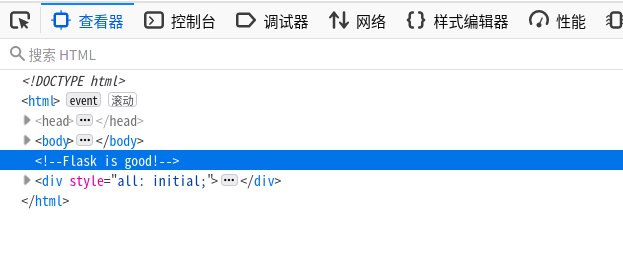

# Pt.2 Wordle 挑战

*如果你每次都能猜对，那么只需要 `10 * 300 / 60 = 50` 小时就能获得 flag 了*

查看页面源代码，可以发现有一个 “Flask is good!” 的注释

推测出这是用 Flask 编写的，而~~众所周知~~ Flask 会将**签名但不加密**的 session 存储在客户端的 cookie 里

参考[这篇博客](https://www.leavesongs.com/PENETRATION/client-session-security.html)，将浏览器 cookie 中的 session 放到文中的 Python 脚本里解码，会发现 session 其实是一个编码后的 json 字符串

注意到 session 中的 `level` 就是我们的等级。由于 Flask 是完全将 session 保存在客户端的，所以我们可以试着把它改成大等于 `300` 的值

但是 Flask 在生成 session 之后会对其进行签名，如果只修改了数据，就会导致校验不通过。

我们可以使用 [Flask-Unsign](https://github.com/Paradoxis/Flask-Unsign) 来破解 `secret_key`，最终会得到 `secret_key` 为 `YOUR_SECRET_KEY_HERE`

使用这个 `secret_key` 来签名修改后的 `session`，并将其发送到服务器，可以得到 `flag{th3_b1tc0in_1s_a_lie}`
