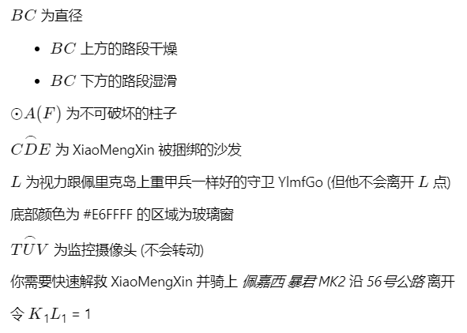

# Pt.3 - 要贴贴

## 描述

出题人: ShiSheng

## 题目

ShiSheng 为了更好地跟 [XiaoMengXin](https://github.com/XiaoMengXinX) [贴贴](https://t.me/c/1345619387/659), 他把 XiaoMengXin 关在了猫妈妈的必贵园别野里

找到 XiaoMengXin 需要 *别野的密码锁的密码* 以及 *捆绑 XiaoMengXin 的锁的密码*

趁着 ShiSheng 不在, [可爱绒布鱼](https://github.com/lz233) 准备去营救 [XiaoMengXin](https://github.com/XiaoMengXinX)

她进行了简单的勘察, 勘测结果如图

* 地形由图上的表达式表示 (图像为二维的函数默认为从 **X轴上自 +∞ 向 -∞ 方向** 行走)

* 小区门口的密码锁密码由 **最好走的一条路** 决定

  * 若通过 1 2 两段路 定义密码 `a` 为 `114514`

  * 若通过 1 2 3 三段路 定义密码 `a` 为 `1919810`
  

她成功地打开了门禁, 进入了 *猫妈妈的必贵园别野*

她从B点进入屋内

屋内平面结构如图所示

$BC$ 为直径

* $BC$ 上方的路段干燥

* $BC$ 下方的路段湿滑

$\odot A(F)$ 为不可破坏的柱子

$\overset{\frown} {CDE}$ 为 XiaoMengXin 被捆绑的沙发

$L$ 为视力跟佩里克岛上重甲兵一样好的守卫 YlmfGo (但他不会离开 $L$ 点)

底部颜色为 #E6FFFF 的区域为玻璃窗

$\overset{\frown} {TUV}$ 为监控摄像头 (不会转动)

你需要快速解救 XiaoMengXin 并骑上 *佩嘉西 暴君 MK2* 沿 *56号公路* 离开

令 $K$1$L$1 = 1

求 从 B点出发 接到 XiaoMengXin 并获取到 *佩嘉西 暴君 MK2* 的最短路径长即为*捆绑 XiaoMengXin 的锁的密码* `b`

---

先计算 `tmp = a` **XOR** `b`

提交 `flag{md5($tmp + 1)}`
