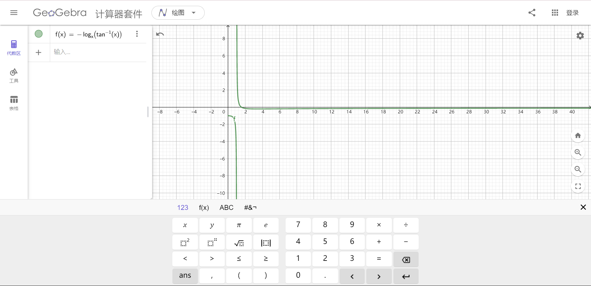

# Pt.3 - 要贴贴

## Part 1

如图, 再自行判断即可得出答案为*跨越 1 2 3 区域*

得到 `a = 1919810`

## Part 2

同时提供 ggb 工程文件 [test2.ggb](img/answer/test2.ggb) , 在 GeoGebra 中导入即可

测量得到 `b = 9`

## 答案

`tmp = 1919819`

得到答案 `flag{65655023DBF0535D4B6BFEA0C8D83E5D}`
